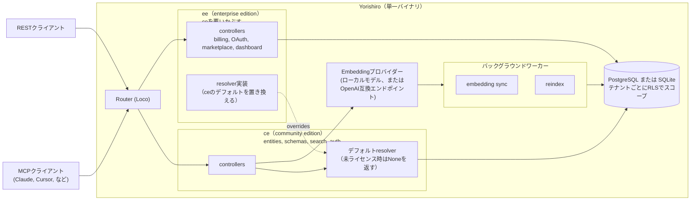

# Yorishiro (依り代)

**[English](README.md)** | 日本語

自分のデータ構造を定義し、キーワードだけでなく意味で検索できるナレッジストア。

## できること

- **自分のデータ構造を定義する**
  - フィールド、バリデーションルール、エンティティ間のリレーションを持つエンティティ型を作成できます。データモデルが変わってもコード修正は不要。
  - APIでスキーマ、エンティティ型、リレーションを管理。
  - JSONLファイルからデータをインポート。

- **意味で検索する**
  - 「配送に関する顧客クレーム」といった説明を入力すると、正確に同じ言葉がなくても関連するレコードが見つかります。
  - ローカル埋め込み（multilingual-e5-base）またはOpenAI互換エンドポイントでのベクトル検索対応。
  - 埋め込みがまだ生成されていないレコードもキーワード検索でカバー。

- **AIツールに接続**
  - Claude、Cursor、他のMCP対応クライアントが24個の組み込みMCPツールを使ってデータを検索・作成・管理できます。

- **REST API**
  - 標準HTTPエンドポイントで自動化できます。

- **チームで整理する**
  - テナントとワークスペース、ロールベースのアクセス制御でデータを適切に分割・共有できます。

## アーキテクチャ

## エディション

ceでできることはeeでもすべて利用可能です。eeはceの上に以下の機能を追加します：

| 機能 | コミュニティエディション(無料) | エンタープライズエディション |
|---|---|---|
| ワークスペースごとの埋め込みプロバイダ割り当て | — | 利用可能 |
| ワークスペースごとのLLM推論キー & fill | — | 利用可能 |
| テンプレートマーケットプレイス | — | 利用可能 |
| OAuth2 / OIDCログイン | — | 利用可能 |
| Stripe課金 | — | 利用可能 |

1つのバイナリ、1つのリポジトリ。エンタープライズ機能はライセンスキーで有効化します。

## クイックスタート

デフォルト設定はSQLiteを使用しており、外部データベースは不要です。

1. `http://localhost/` にアクセスし、セットアップウィザードでアカウントを作成。
2. APIキーを生成し、エンティティの作成を開始。

インストール手順は [docs/ja/installation.md](docs/ja/installation.md) を参照してください。

## 設定

設定は環境変数で行います：

| 変数 | デフォルト | 説明 |
|---|---|---|
| `DATABASE_URL` | `sqlite:///var/lib/yorishiro/yorishiro.sqlite3?mode=rwc` | マルチテナントまたはベクトル検索には `postgres://` を指定 |
| `YORISHIRO_MAX_TENANTS` | `1` | テナント上限（`0` = 無制限） |
| `YORISHIRO_LICENSE_KEY` | *(空)* | エンタープライズライセンスキー |
| `YORISHIRO_EMBEDDING_PROVIDER` | `local` | 埋め込みバックエンド（`none` で無効） |
| `YORISHIRO_EMBEDDING_BASE_URL` | *(空)* | OpenAI互換埋め込みエンドポイント |
| `YORISHIRO_EMBEDDING_MODEL` | *(空)* | 埋め込みモデル名 |
| `YORISHIRO_EMBEDDING_API_KEY` | *(空)* | 埋め込みAPIキー |
| `YORISHIRO_EMBEDDING_DIMENSIONS` | `768` | ベクトルの次元数 |
| `YORISHIRO_EMBEDDING_SEND_DIMENSIONS_PARAM` | `false` | リクエストに `dimensions` フィールドを含める |
| `YORISHIRO_EMBEDDING_BASE_URL` + `YORISHIRO_EMBEDDING_MODEL` 設定済み | — | OpenAI互換プロバイダを使用 |
| `YORISHIRO_QUEUE_KIND` | 自動検出 | Valkey/Redis キューには `Redis` を設定 |
| `QUEUE_URL` | `DATABASE_URL` と共有 | Redis キューに必須 |

全一覧は [docs/ja/configuration.md](docs/ja/configuration.md) を参照してください。

## ドキュメント

| ドキュメント | 内容 |
|---|---|
| [docs/ja/installation.md](docs/ja/installation.md) | Docker、Docker Compose、deb/rpm、ソースからビルド |
| [docs/ja/configuration.md](docs/ja/configuration.md) | 全設定：埋め込み、検索クォータ、ログ、キューバックエンド |
| [docs/ja/sqlite.md](docs/ja/sqlite.md) | SQLiteモード：機能と制限 |
| [CONTRIBUTING.md](CONTRIBUTING.md) | 貢献ガイドライン |
| [AGENTS.md](AGENTS.md) | AIエージェント向け情報 |

## ライセンス

[Business Source License 1.1](LICENSE) の下でライセンスされています。セルフホスティングは許可されています。2030-07-14 にこのバージョンはGNU General Public License Version 2.0以降に自動的に変換されます。
