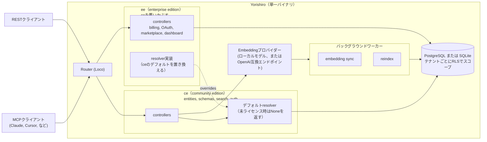

# Yorishiro (依り代)

**[English](README.md)** | 日本語

自分のデータ構造を定義し、キーワードだけでなく意味で検索できるナレッジストア。

## できること

- **自分のデータ構造を定義する**
  - フィールド、バリデーションルール、エンティティ間のリレーションを持つエンティティ型を作成できます。データモデルが変わってもコード修正は不要。
  - APIでスキーマ、エンティティ型、リレーションを管理。
  - JSONLファイルからデータをインポート。

- **意味で検索する**
  - 「配送に関する顧客クレーム」といった説明を入力すると、正確に同じ言葉がなくても関連するレコードが見つかります。
  - ローカル埋め込み（multilingual-e5-base）またはOpenAI互換エンドポイントでのベクトル検索対応。
  - 埋め込みがまだ生成されていないレコードもキーワード検索でカバー。

- **AIツールに接続**
  - コミュニティモードでは、Claude、Cursor、他のMCP対応クライアントが組み込みMCPツールを使ってデータを検索・作成・管理できます。
  - ライセンスが有効なエンタープライズ環境では、originテンプレートの更新検出、プレビュー、マージのツールが追加されます。

- **REST API**
  - 標準HTTPエンドポイントで自動化できます。

- **チームで整理する**
  - テナントとワークスペース、ロールベースのアクセス制御でデータを適切に分割・共有できます。

## アーキテクチャ

```mermaid
flowchart LR
    MCP["MCPクライアント<br/>(Claude, Cursor, など)"]
    REST["RESTクライアント"]

    subgraph Server["Yorishiro（単一バイナリ）"]
        Router["Router (Loco)"]

        subgraph CE["ce（community edition）<br/>entities, schemas, search, auth"]
            direction TB
            CEControllers["controllers"]
            CEResolvers["デフォルトresolver<br/>（未ライセンス時はNoneを返す）"]
        end

        subgraph EE["ee（enterprise edition）<br/>ceを覆いかぶす"]
            direction TB
            EEControllers["controllers<br/>billing, OAuth, marketplace, dashboard"]
            EEResolvers["resolver実装<br/>（ceのデフォルトを置き換える）"]
        end

        Embed["Embeddingプロバイダー<br/>(ローカルモデル、または<br/>OpenAI互換エンドポイント)"]

        subgraph Workers["バックグラウンドワーカー"]
            direction TB
            WEmbed["embedding sync"]
            WReindex["reindex"]
        end

        DB[("PostgreSQL または SQLite<br/>テナントごとにRLSでスコープ")]
    end

    MCP --> Router
    REST --> Router
    Router --> CEControllers
    Router --> EEControllers
    EEResolvers -.overrides.-> CEResolvers
    CEControllers --> CEResolvers
    CEResolvers --> DB
    EEControllers --> DB
    CEControllers --> Embed
    Embed --> Workers
    Workers --> DB
```

## エディション

ceでできることはeeでもすべて利用可能です。eeはceの上に以下の機能を追加します：

| 機能 | コミュニティエディション(無料) | エンタープライズエディション |
|---|---|---|
| ワークスペースごとの埋め込みプロバイダ割り当て | — | 利用可能 |
| ワークスペースごとのLLM推論キー & fill | — | 利用可能 |
| テンプレートマーケットプレイス | — | 利用可能 |
| OAuth2 / OIDCログイン | — | 利用可能 |
| Stripe課金 | — | 利用可能 |

1つのバイナリ、1つのリポジトリ。エンタープライズ機能はライセンスキーで有効化します。

### MCPツール一覧

実行時のMCPインベントリには、ツール名、説明、入力スキーマが含まれます。詳細は [docs/ja/mcp-tools.md](docs/ja/mcp-tools.md) を参照してください。

ライセンスが有効なエンタープライズ環境では、同ドキュメントに示すoriginテンプレート用ツールが追加されます。
コミュニティモードでは、これらのツールはMCP上に表示されず、呼び出すこともできません。

## クイックスタート

デフォルト設定はSQLiteを使用しており、外部データベースは不要です。

1. `http://localhost/` にアクセスし、セットアップウィザードでアカウントを作成。
2. APIキーを生成し、エンティティの作成を開始。

バックグラウンドキューを使うソースチェックアウトでは、サーバーとタグ付きワーカーを別々に起動します。
`cargo loco start` と `cargo loco start --worker="$(cargo loco worker-tags)"` を実行してください。

インストール手順は [docs/ja/installation.md](docs/ja/installation.md) を参照してください。

## 設定

設定は Loco 標準の `config/` 配下に置きます。
`LOCO_ENV` が `config/<environment>.yaml` を選び、`LOCO_CONFIG_FOLDER` で別の設定ディレクトリを指定できます。
YAML では Loco の Tera `get_env` 式を使ってデプロイ時の値を上書きします。
ソース開発では `config/development.yaml` を使い、パッケージと Docker では `config/production.yaml` を使います。
アプリケーションデータは SQLite または PostgreSQL を利用できます。
キューの保存先は Loco のキュープロバイダとして独立して選択でき、このリリースでは SQLite、PostgreSQL、Redis 互換プロバイダを利用できます。
バックエンド変数を設定しない場合のみ、パッケージと Docker は SQLite の既定データを `/var/lib/yorishiro` に保存します。

## ドキュメント

| ドキュメント | 内容 |
|---|---|
| [docs/ja/installation.md](docs/ja/installation.md) | Docker、Docker Compose、deb/rpm、ソースからビルド |
| [docs/ja/configuration.md](docs/ja/configuration.md) | 全設定：埋め込み、検索クォータ、ログ、キューバックエンド |
| [docs/ja/sqlite.md](docs/ja/sqlite.md) | SQLiteモード：機能と制限 |
| [CONTRIBUTING.md](CONTRIBUTING.md) | 貢献ガイドライン |
| [AGENTS.md](AGENTS.md) | AIエージェント向け情報 |

## ライセンス

[Business Source License 1.1](LICENSE) の下でライセンスされています。セルフホスティングは許可されています。2030-07-14 にこのバージョンはGNU General Public License Version 2.0以降に自動的に変換されます。
