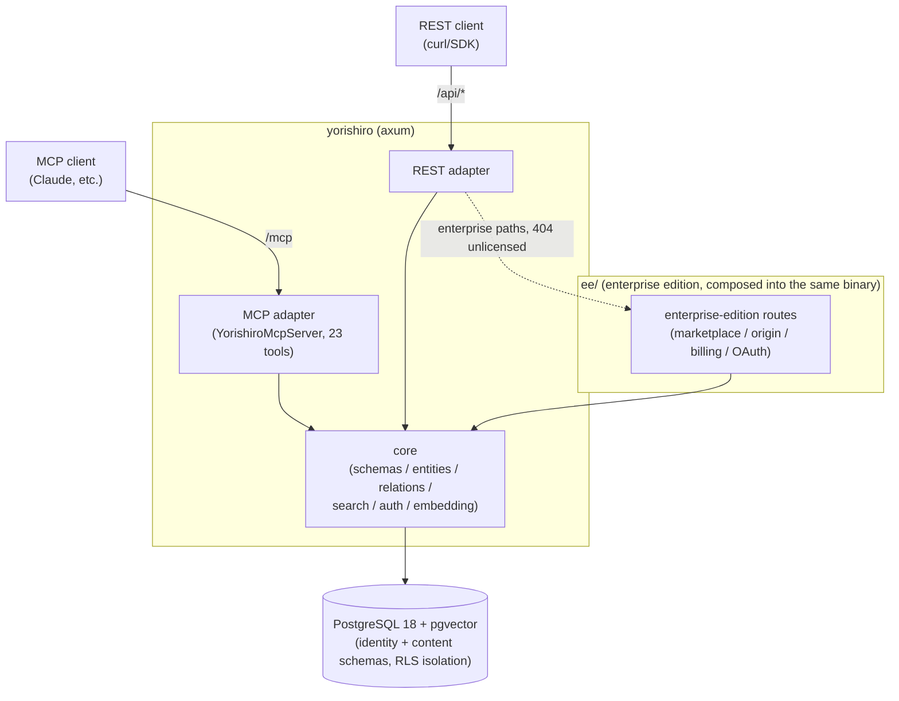
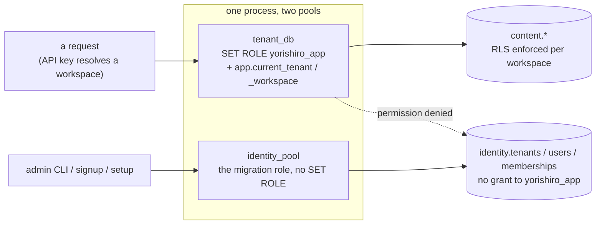
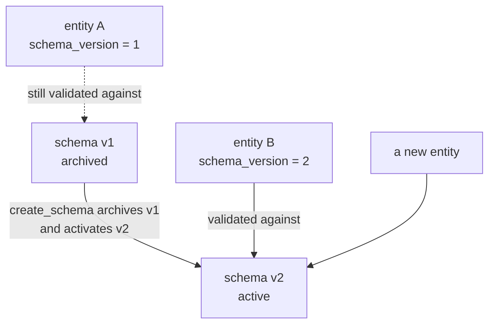

# Yorishiro (依り代)

**English** (a Japanese translation of this README is not written yet; `docs/ja/` carries the Japanese documentation that does exist)

An MCP-native, multi-tenant knowledge store with user-defined schemas.

Users define entity "types" (fields, constraints, relations) as JSON meta-schemas, and data validated against those schemas can be read and written through both a REST API and MCP (Model Context Protocol).
Fields marked `x-embed` are automatically vector-embedded, enabling similarity search over natural-language queries.

## Architecture



Without a licence key, the inner subgraph is what a deployment serves on its own: the same API routes, with the enterprise surfaces answering `404`.
It serves no Web UI, since the SPA lives under `ee/`.

- Cargo workspace
  - One application crate at the repository root, plus `migration/`.
  - `src/models/` owns the models and issues the queries; `src/controllers/` adapts them to HTTP, and `src/services/mcp/` to MCP.
  - The enterprise edition lives under `ee/`, compiled into the same crate and gated at runtime rather than at build time.
- Two-tier tenancy
  - A **tenant** is an organization/account, with human **users** attached via roles: owner/admin/member/viewer.
    A tenant owns one or more **workspaces**.
  - All content (schemas/entities/relations) and API keys belong to exactly one workspace, not the tenant directly.
  - This lets one organization run several isolated projects (e.g. prod/staging, or one workspace per team) without separate tenants, and lets several people share administrative access to the same tenant.
- Isolation via RLS
  - PostgreSQL Row Level Security is applied to every table.
  - On each request, the workspace (and its owning tenant) are resolved from the API key.
  - Data can only be reached through a connection that has set the `app.current_tenant`/`app.current_workspace` session variables.
  - The application runs as a dedicated role (`yorishiro_app`, without `BYPASSRLS`).
    Control-plane tables (`identity.tenants`/`identity.users`/`identity.tenant_memberships`) aren't reachable by that role at all.
    They are managed over the migration-role pool instead: the admin CLI, and the signup and setup endpoints, which run before any tenant or workspace context exists for RLS to scope by.

  One process holds two pools against the same database, and which one a request uses decides what it can reach:



  The dotted edge is the point: a request cannot read the control plane even if its query asks for it, because the role holds no grant on those tables.
- Quotas
  - A tenant's `max_workspaces` and a workspace's `max_entities` are enforced at creation time (workspace creation / entity creation, respectively).
  - Both default to `NULL` (unlimited).
    An operator can set explicit caps per tenant/workspace.
- Schema versioning
  - Re-registering a schema with the same name adds a new version.
  - Breaking changes (removed fields, type changes, newly required fields, etc.) are reported as a diff.
  - Existing entities continue to be validated against the schema version that was active when they were created.

  Nothing is rewritten when a version is issued, so an entity written yesterday keeps the rules it was written under:



  A version bump is therefore cheap and non-destructive: no bulk rewrite runs, and no existing row becomes invalid.
- Single binary
  - Everything above ships in the single `yorishiro` binary.
  - Defaults to a single-tenant deployment (`YORISHIRO_MAX_TENANTS=1`). Setting it to `0` means unlimited tenants,
    which also disables the first-run setup wizard below: unlimited and unset are the same value internally, and the
    wizard only appears when a cap is set.
  - That same cap also enables a first-run setup wizard (browser UI at `/`, or `POST /setup`) that creates the tenant, workspace, and owner account in one step, no admin CLI needed.
  - Beyond that first account, further account creation is invite-only (`admin create-invite` → `POST /auth/signup` → `POST /auth/login`).
  - Tenant owners/admins can then manage members (`/api/members`) and workspaces (`/api/workspaces`) over REST, or through the same browser UI, without touching the admin CLI.

## Quick start

A full setup guide covering the prebuilt binary and background/systemd operation is not written yet.
The fastest path, with Docker:

1. Nothing to fetch by hand: the local embedding provider (`YORISHIRO_EMBEDDING_PROVIDER=local`) downloads and verifies its model on first use, so this step is only for placing one yourself instead (see `docs/configuration.md`).

2. Start the server:

   ```console
   $ docker run -d --name yorishiro --restart unless-stopped -p 8080:8080 \
       -v "$(pwd)/models:/app/models:ro" \
       -e DATABASE_URL=postgres://... \
       ghcr.io/yotsunagi/yorishiro:latest
   ```

   This is a complete single-tenant deployment as-is.
3. Visit `http://localhost:8080/` and create the owner account through the setup wizard.

Prefer building from source? Clone the repo, place the model files as in step 1, then `make init` (needs Docker Compose and `make`) builds and starts PostgreSQL plus the app:

```console
$ git clone https://github.com/yotsunagi/yorishiro && cd yorishiro
$ make init
```

## Editions

One repository, one image, one binary.
Configuration decides what is enabled, not which artifact you installed.

| | Without a licence key | With `YORISHIRO_LICENSE_KEY` |
|---|---|---|
| Enterprise API surfaces | `404` | Served |
| Everything else | Served | Served |
| Web UI | Served either way, since the SPA is not licence-gated | |
| Licence | [BUSL-1.1](LICENSE), plus [`ee/LICENSE`](ee/LICENSE) for the `ee/` directory | |

The single `yorishiro` binary contains `ee/`, and its enterprise API surfaces answer `404` until a valid licence key is configured.
The check runs per request rather than at startup, so a key that expires while the process runs stops unlocking those surfaces without a restart.

The Stripe webhook is one of those surfaces, so a deployment with no valid licence does not receive Stripe events.
An operator running billing needs the licence key configured for the webhook to be reachable at all, and a key that lapses stops deliveries the same way it closes any other enterprise route.

OAuth/OIDC login is another, so an unlicensed deployment cannot serve SSO login.
Anyone who signs in that way needs a password credential for `POST /auth/login` instead, which is worth checking before a licence is allowed to lapse.

`ee/LICENSE` covers the `ee/` directory, and the root [BUSL-1.1](LICENSE) covers the repository excluding it.
`ee/LICENSE` states at the top of the file that it is a draft not yet settled by counsel.

## Documentation

| Document | Contents |
|---|---|
| [docs/configuration.md](docs/configuration.md) | Environment variables: embedding providers, the search token quota, queue tuning, logging |
| [docs/sqlite.md](docs/sqlite.md) | The SQLite tier: what it supports, what it does not, and why |
| [CONTRIBUTING.md](CONTRIBUTING.md) | Where code goes, how `tests/` mirrors `src/`, what to run before pushing |

Not yet written: a setup guide, a meta-schema guide, a REST/MCP API reference, a deployment guide and operational notes.
Their subjects are covered where they are implemented rather than in prose, so `docs/configuration.md` and the doc comments are what to read until those documents exist.

## Development

Day-to-day development commands run through a separate `dev` service (Rust toolchain, started on demand rather than as part of `make up`):

```console
$ make fmt-check
$ make clippy
$ make test
$ make shell   # ad-hoc cargo/psql/sqlx-cli access
```

Placing `model.safetensors` and `tokenizer.json` under `models/` enables embedding integration tests against the real model (they're skipped automatically otherwise).

## License

Licensed under the [Business Source License 1.1](LICENSE).
Self-hosting (including for internal/commercial use) is permitted; the only restriction is offering Yorishiro itself as a competing hosted/managed service.
On 2030-07-14 this version automatically converts to the GNU General Public License, Version 2.0 or later.
