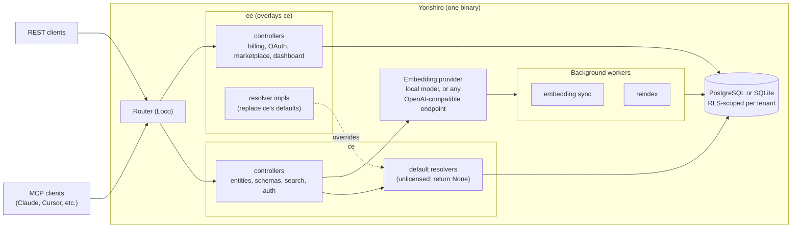

# Yorishiro (依り代)

**English** | [日本語](README.jp.md)

A knowledge store where you define your own data structures and search by meaning, not just keywords.

## What it does

- **Define your own data structures**
  - Create entity types with fields, validation rules, and cross-entity relations. No code changes needed when your data model evolves.
  - Manage schemas, entity types, and relations through the API.
  - Import data from JSONL files.

- **Search by meaning**
  - Type a description like "customer complaint about shipping" and find related records even if none of them contain those exact words.
  - Built-in embeddings: local (multilingual-e5-base) or any OpenAI-compatible endpoint.
  - Full-text fallback when embeddings are not yet available.

- **Connect to AI tools**
  - 23 built-in MCP tools for Claude, Cursor, and other MCP-compatible clients to search, create, and manage your data.

- **REST API**
  - Automate everything with standard HTTP endpoints.

- **Organize with teams**
  - Tenants and workspaces with role-based access keep data scoped and shared as you choose.

## Architecture

## Editions

Everything you can do in ce is also available in ee. ee adds the following on top of ce:

| Feature | Community Edition(Free) | Enterprise Edition |
|---|---|---|
| Per-workspace embedding provider assignment | — | Available |
| Per-workspace LLM inference keys & fill | — | Available |
| Template marketplace | — | Available |
| OAuth2 / OIDC login | — | Available |
| Stripe billing | — | Available |

One binary, one repository. Enterprise features are controlled by a licence key.

## Quick start

The default configuration uses SQLite — no external database required.

1. Open `http://localhost/` and create an account through the setup wizard.
2. Generate an API key and start creating entities.

For installation instructions, see [docs/installation.md](docs/installation.md).

## Configuration

Most settings come from environment variables:

| Variable | Default | Description |
|---|---|---|
| `DATABASE_URL` | `sqlite:///var/lib/yorishiro/yorishiro.sqlite3?mode=rwc` | `postgres://` URI for multi-tenant or vector search |
| `YORISHIRO_MAX_TENANTS` | `1` | Tenant limit (`0` = unlimited) |
| `YORISHIRO_LICENSE_KEY` | *(empty)* | Enterprise licence key |
| `YORISHIRO_EMBEDDING_PROVIDER` | `local` | Embedding backend (`none` disables embeddings) |
| `YORISHIRO_EMBEDDING_BASE_URL` | *(empty)* | OpenAI-compatible embeddings endpoint |
| `YORISHIRO_EMBEDDING_MODEL` | *(empty)* | Embeddings model name |
| `YORISHIRO_EMBEDDING_API_KEY` | *(empty)* | Embeddings API key |
| `YORISHIRO_EMBEDDING_DIMENSIONS` | `768` | Expected vector size |
| `YORISHIRO_EMBEDDING_SEND_DIMENSIONS_PARAM` | `false` | Include `dimensions` in requests |
| `YORISHIRO_EMBEDDING_BASE_URL` + `YORISHIRO_EMBEDDING_MODEL` set | — | Uses the OpenAI-compatible provider |
| `YORISHIRO_QUEUE_KIND` | Auto-detected | Set to `Redis` for Valkey/Redis queue |
| `QUEUE_URL` | Shares `DATABASE_URL` | Required for Redis queue |

See [docs/configuration.md](docs/configuration.md) for the full list.

## Documentation

| Document | Contents |
|---|---|
| [docs/en/installation.md](docs/en/installation.md) | Docker, Docker Compose, deb/rpm, and build from source |
| [docs/en/configuration.md](docs/en/configuration.md) | All settings: embedding, search quotas, logging, queue backends |
| [docs/en/sqlite.md](docs/en/sqlite.md) | SQLite mode: capabilities and limitations |
| [CONTRIBUTING.md](CONTRIBUTING.md) | Contributing guidelines |
| [AGENTS.md](AGENTS.md) | Notes for AI agents |

## License

Licensed under the [Business Source License 1.1](LICENSE). Self-hosting is permitted. On 2030-07-14 this version converts to the GNU General Public License, Version 2.0 or later.
