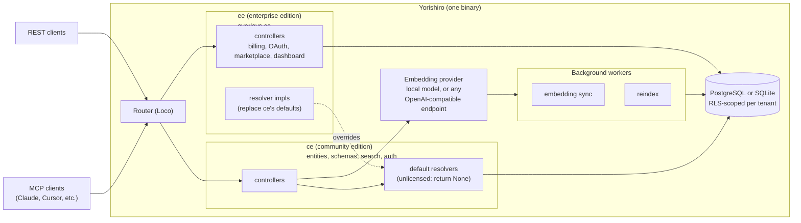

# Yorishiro (依り代)

**English** | [日本語](README.jp.md)

A knowledge store where you define your own data structures and search by meaning, not just keywords.

## What it does

- **Define your own data structures**
  - Create entity types with fields, validation rules, and cross-entity relations. No code changes needed when your data model evolves.
  - Manage schemas, entity types, and relations through the API.
  - Import data from JSONL files.

- **Search by meaning**
  - Type a description like "customer complaint about shipping" and find related records even if none of them contain those exact words.
  - Built-in embeddings: local (multilingual-e5-base) or any OpenAI-compatible endpoint.
  - Full-text fallback when embeddings are not yet available.

- **Connect to AI tools**
  - Community mode provides 24 built-in MCP tools for Claude, Cursor, and other MCP-compatible clients to search, create, and manage your data.
  - A licensed enterprise deployment provides 27 tools by adding origin-template update discovery, preview, and merge.

- **REST API**
  - Automate everything with standard HTTP endpoints.

- **Organize with teams**
  - Tenants and workspaces with role-based access keep data scoped and shared as you choose.

## Architecture

## Editions

Everything you can do in ce is also available in ee. ee adds the following on top of ce:

| Feature | Community Edition(Free) | Enterprise Edition |
|---|---|---|
| Per-workspace embedding provider assignment | — | Available |
| Per-workspace LLM inference keys & fill | — | Available |
| Template marketplace | — | Available |
| OAuth2 / OIDC login | — | Available |
| Stripe billing | — | Available |

One binary, one repository. Enterprise features are controlled by a licence key.

### MCP tool inventory

Community mode exposes these 24 tools: `create_entity`, `create_relation`, `create_schema`, `delete_entity`, `delete_relation`, `fill_defaults`, `get_active_schema`, `get_entity`, `get_entity_drift`, `get_entity_type_json_schema`, `get_relation`, `get_schema_by_id`, `get_template_library_item`, `import_jsonl`, `list_entities`, `list_relations`, `list_schemas`, `list_template_library`, `list_templates`, `migration_dry_run`, `recall_context`, `search_entities`, `set_relation_status`, and `update_entity`.

A licensed enterprise deployment exposes all 24 community tools plus `list_upstream_changes`, `merge_preview`, and `merge_apply`, for 27 tools total.
The three origin tools are not advertised or callable through MCP in community mode.

## Quick start

The default configuration uses SQLite — no external database required.

1. Open `http://localhost/` and create an account through the setup wizard.
2. Generate an API key and start creating entities.

For installation instructions, see [docs/en/installation.md](docs/en/installation.md).

## Configuration

The public configuration file is `yorishiro.yaml`, written as plain YAML. Run
`yorishiro config init` to create a fully commented local skeleton; use
`--force` only when replacing an existing file intentionally. Configuration is
resolved in this order: `YORISHIRO_CONFIG_PATH` when set (a missing, unreadable,
or invalid file is an error), `./yorishiro.yaml`, then the legacy
`config/{environment}.yaml` files as a migration fallback. Environment variables
explicitly override supported fields; Tera and `get_env` expressions are not
accepted in the canonical file. The generated local skeleton uses a relative
SQLite path, while package and Docker installations use `/var/lib/yorishiro`.

## Documentation

| Document | Contents |
|---|---|
| [docs/en/installation.md](docs/en/installation.md) | Docker, Docker Compose, deb/rpm, and build from source |
| [docs/en/configuration.md](docs/en/configuration.md) | All settings: embedding, search quotas, logging, queue backends |
| [docs/en/sqlite.md](docs/en/sqlite.md) | SQLite mode: capabilities and limitations |
| [CONTRIBUTING.md](CONTRIBUTING.md) | Contributing guidelines |
| [AGENTS.md](AGENTS.md) | Notes for AI agents |

## License

Licensed under the [Business Source License 1.1](LICENSE). Self-hosting is permitted. On 2030-07-14 this version converts to the GNU General Public License, Version 2.0 or later.
