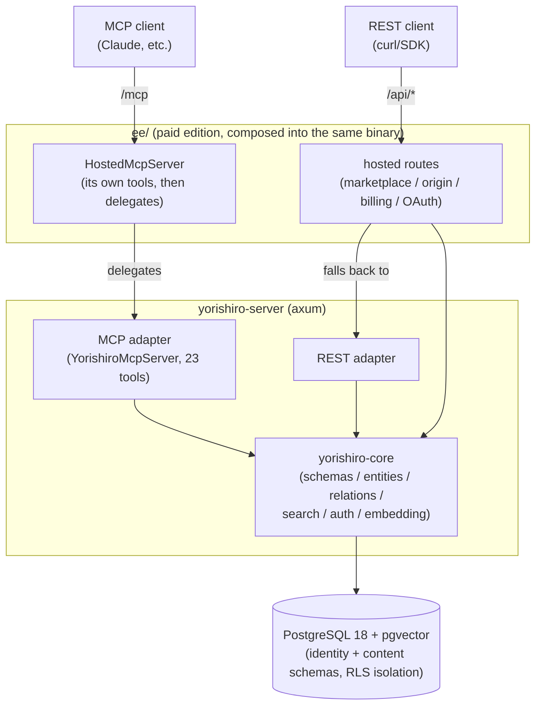
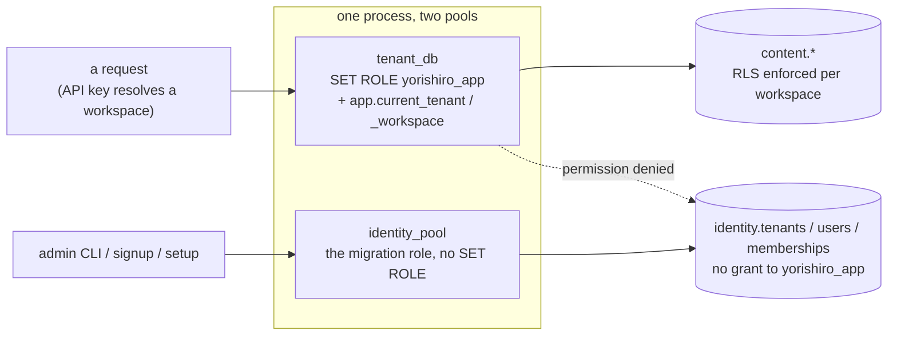
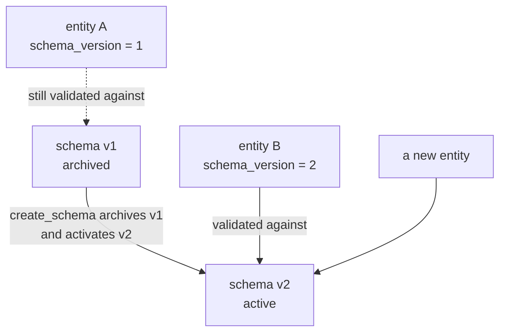

# Yorishiro (依り代)

**English** | [日本語](docs/ja/README.md)

An MCP-native, multi-tenant knowledge store with user-defined schemas.

Users define entity "types" (fields, constraints, relations) as JSON meta-schemas, and data validated against those schemas can be read and written through both a REST API and MCP (Model Context Protocol).
Fields marked `x-embed` are automatically vector-embedded, enabling similarity search over natural-language queries.

## Architecture



The community binary (`yorishiro-ce-server`) is the inner subgraph on its own: the same API routes, without `ee/` in front of them.
It serves no Web UI, since the SPA lives under `ee/`.

- Cargo workspace
  - `yorishiro-core` (domain logic) and `yorishiro-server` (HTTP server and adapter layer).
  - `yorishiro-core` owns the models and issues the queries; `yorishiro-server` adapts them to HTTP and MCP.
- Two-tier tenancy
  - A **tenant** is an organization/account, with human **users** attached via roles: owner/admin/member/viewer.
    A tenant owns one or more **workspaces**.
  - All content (schemas/entities/relations) and API keys belong to exactly one workspace, not the tenant directly.
  - This lets one organization run several isolated projects (e.g. prod/staging, or one workspace per team) without separate tenants, and lets several people share administrative access to the same tenant.
- Isolation via RLS
  - PostgreSQL Row Level Security is applied to every table.
  - On each request, the workspace (and its owning tenant) are resolved from the API key.
  - Data can only be reached through a connection that has set the `app.current_tenant`/`app.current_workspace` session variables.
  - The application runs as a dedicated role (`yorishiro_app`, without `BYPASSRLS`).
    Control-plane tables (`identity.tenants`/`identity.users`/`identity.tenant_memberships`) aren't reachable by that role at all.
    They are managed over the migration-role pool instead: the admin CLI, and the signup and setup endpoints, which run before any tenant or workspace context exists for RLS to scope by.

  One process holds two pools against the same database, and which one a request uses decides what it can reach:



  The dotted edge is the point: a request cannot read the control plane even if its query asks for it, because the role holds no grant on those tables.
- Quotas
  - A tenant's `max_workspaces` and a workspace's `max_entities` are enforced at creation time (workspace creation / entity creation, respectively).
  - Both default to `NULL` (unlimited).
    An operator can set explicit caps per tenant/workspace.
- Schema versioning
  - Re-registering a schema with the same name adds a new version.
  - Breaking changes (removed fields, type changes, newly required fields, etc.) are reported as a diff.
  - Existing entities continue to be validated against the schema version that was active when they were created.

  Nothing is rewritten when a version is issued, so an entity written yesterday keeps the rules it was written under:



  A version bump is therefore cheap and non-destructive: no bulk rewrite runs, and no existing row becomes invalid.
- Single binary
  - Everything above ships in the single `yorishiro-server` binary.
  - Defaults to a single-tenant deployment (`YORISHIRO_MAX_TENANTS=1`; set it to `0` for unlimited tenants).
  - That same cap also enables a first-run setup wizard (browser UI at `/`, or `POST /setup`) that creates the tenant, workspace, and owner account in one step, no admin CLI needed.
  - Beyond that first account, further account creation is invite-only (`admin create-invite` → `POST /auth/signup` → `POST /auth/login`).
  - Tenant owners/admins can then manage members (`/api/members`) and workspaces (`/api/workspaces`) over REST, or through the same browser UI, without touching the admin CLI.

## Quick start

See [docs/setup.md](docs/setup.md) for the full guide, including the prebuilt binary and background/systemd operation.
The fastest path, with Docker:

1. Fetch the embedding model (the default local ONNX provider needs no external service):

   ```console
   $ mkdir -p models
   $ curl -L -o models/model.onnx \
       https://huggingface.co/Xenova/multilingual-e5-large/resolve/main/onnx/model_quantized.onnx
   $ curl -L -o models/tokenizer.json \
       https://huggingface.co/Xenova/multilingual-e5-large/resolve/main/tokenizer.json
   ```

2. Start the server:

   ```console
   $ docker run -d --name yorishiro --restart unless-stopped -p 8080:8080 \
       -v "$(pwd)/models:/app/models:ro" \
       -e DATABASE_URL=postgres://... \
       ghcr.io/yotsunagi/yorishiro:latest
   ```

   This is a complete single-tenant deployment as-is.
3. Visit `http://localhost:8080/` and create the owner account through the setup wizard.

Prefer building from source? Clone the repo, place the model files as in step 1, then `make init` (needs Docker Compose and `make`) builds and starts PostgreSQL plus the app:

```console
$ git clone https://github.com/yotsunagi/yorishiro && cd yorishiro
$ make init
```

## Editions

One repository, one image, two binaries.
Which one you run decides what is on disk, not what you configure.

| | `yorishiro-server` | `yorishiro-ce-server` |
|---|---|---|
| Contains | Everything, including `ee/` | BUSL-1.1 only, no trace of `ee/` |
| Paid features | Enabled by `YORISHIRO_LICENSE_KEY`, otherwise `404` | Not present |
| Web UI | Served from the binary | None: `/` answers `404` |
| Licence | [BUSL-1.1](LICENSE) plus [`ee/LICENSE`](ee/LICENSE) for `ee/` | [BUSL-1.1](LICENSE) |

The default artifact is `yorishiro-server`, and without a licence key its paid API surfaces answer `404`.
It is still not the same as the community binary: `ee/` is on disk, and the Web UI is served either way, since the SPA is not licence-gated.
`yorishiro-ce-server` exists for a deployment that cannot have proprietary code on disk at all: a distribution policy, a redistribution requirement, an audit that reads the package rather than the configuration.

The paid half documents itself in [`ee/README.md`](ee/README.md) ([日本語](ee/docs/ja/README.md)).

## Documentation

| Document | Contents |
|---|---|
| [docs/setup.md](docs/setup.md) | Full setup guide: startup, endpoints, tenant/workspace/user/API key provisioning, auth & scopes |
| [docs/schema.md](docs/schema.md) | Meta-schema guide for defining entity types and relations |
| [docs/api.md](docs/api.md) | REST API and MCP tool reference |
| [docs/embedding-providers.md](docs/embedding-providers.md) | Configuring embedding providers (`local` ONNX / `openai`-compatible) |
| [docs/configuration.md](docs/configuration.md) | Environment variable / `config.yml` reference |
| [docs/deployment.md](docs/deployment.md) | Production deployment guide |
| [docs/operations.md](docs/operations.md) | Operational notes: backups, rate limiting, observability |
| [CONTRIBUTING.md](CONTRIBUTING.md) | Where code goes, how `tests/` mirrors `src/`, what to run before pushing |

## Development

Day-to-day development commands run through a separate `dev` service (Rust toolchain, started on demand rather than as part of `make up`):

```console
$ make fmt-check
$ make clippy
$ make test
$ make shell   # ad-hoc cargo/psql/sqlx-cli access
```

Placing an ONNX model under `models/` enables embedding integration tests against the real model (they're skipped automatically otherwise).

## License

Licensed under the [Business Source License 1.1](LICENSE).
Self-hosting (including for internal/commercial use) is permitted; the only restriction is offering Yorishiro itself as a competing hosted/managed service.
On 2030-07-14 this version automatically converts to the GNU General Public License, Version 2.0 or later.
