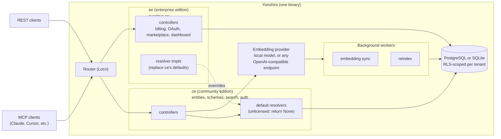

# Yorishiro (依り代)

**English** | [日本語](README.jp.md)

A knowledge store where you define your own data structures and search by meaning, not just keywords.

## What it does

- **Define your own data structures**
  - Create entity types with fields, validation rules, and cross-entity relations. No code changes needed when your data model evolves.
  - Manage schemas, entity types, and relations through the API.
  - Import data from JSONL files.

- **Search by meaning**
  - Type a description like "customer complaint about shipping" and find related records even if none of them contain those exact words.
  - Built-in embeddings: local (multilingual-e5-base) or any OpenAI-compatible endpoint.
  - Full-text fallback when embeddings are not yet available.

- **Connect to AI tools**
  - Community mode provides built-in MCP tools for Claude, Cursor, and other MCP-compatible clients to search, create, and manage your data.
  - A licensed enterprise deployment adds origin-template update discovery, preview, and merge tools.

- **REST API**
  - Automate everything with standard HTTP endpoints.

- **Organize with teams**
  - Tenants and workspaces with role-based access keep data scoped and shared as you choose.

## Architecture

```mermaid
flowchart LR
    MCP["MCP clients<br/>(Claude, Cursor, etc.)"]
    REST["REST clients"]

    subgraph Server["Yorishiro (one binary)"]
        Router["Router (Loco)"]

        subgraph CE["ce (community edition)<br/>entities, schemas, search, auth"]
            direction TB
            CEControllers["controllers"]
            CEResolvers["default resolvers<br/>(unlicensed: return None)"]
        end

        subgraph EE["ee (enterprise edition)<br/>overlays ce"]
            direction TB
            EEControllers["controllers<br/>billing, OAuth, marketplace, dashboard"]
            EEResolvers["resolver impls<br/>(replace ce's defaults)"]
        end

        Embed["Embedding provider<br/>local model, or any<br/>OpenAI-compatible endpoint"]

        subgraph Workers["Background workers"]
            direction TB
            WEmbed["embedding sync"]
            WReindex["reindex"]
        end

        DB[("PostgreSQL or SQLite<br/>RLS-scoped per tenant")]
    end

    MCP --> Router
    REST --> Router
    Router --> CEControllers
    Router --> EEControllers
    EEResolvers -.overrides.-> CEResolvers
    CEControllers --> CEResolvers
    CEResolvers --> DB
    EEControllers --> DB
    CEControllers --> Embed
    Embed --> Workers
    Workers --> DB
```

## Editions

Everything you can do in ce is also available in ee. ee adds the following on top of ce:

| Feature | Community Edition(Free) | Enterprise Edition |
|---|---|---|
| Per-workspace embedding provider assignment | — | Available |
| Per-workspace LLM inference keys & fill | — | Available |
| Template marketplace | — | Available |
| OAuth2 / OIDC login | — | Available |
| Stripe billing | — | Available |

One binary, one repository. Enterprise features are controlled by a licence key.

### MCP tool inventory

The runtime MCP inventory, including names, descriptions, and input schemas, is documented in [docs/en/mcp-tools.md](docs/en/mcp-tools.md).

A licensed enterprise deployment adds the origin-template tools shown in that document.
Those tools are not advertised or callable through MCP in community mode.

## Quick start

The default configuration uses SQLite — no external database required.

1. Open `http://localhost/` and create an account through the setup wizard.
2. Generate an API key and start creating entities.

For a source checkout using a background queue, run the server and tagged worker separately:
`cargo loco start` and `cargo loco start --worker=worker-class:tenant-private,worker-class:official,worker-class:shared,infer-fill`.

For installation instructions, see [docs/en/installation.md](docs/en/installation.md).

## Configuration

Configuration follows Loco's environment layout under `config/`.
`LOCO_ENV` selects `config/<environment>.yaml`, and `LOCO_CONFIG_FOLDER` can select another configuration directory.
The YAML files use Loco's Tera `get_env` expressions for deployment overrides.
Source development defaults to `config/development.yaml`, while package and Docker installations run with `config/production.yaml`.
Application data can use SQLite or PostgreSQL, and the queue can independently use SQLite, PostgreSQL, or Valkey through Loco's `Redis` queue provider.
With no backend variables set, package and Docker installations store the SQLite defaults under `/var/lib/yorishiro`.

## Documentation

| Document | Contents |
|---|---|
| [docs/en/installation.md](docs/en/installation.md) | Docker, Docker Compose, deb/rpm, and build from source |
| [docs/en/configuration.md](docs/en/configuration.md) | All settings: embedding, search quotas, logging, queue backends |
| [docs/en/sqlite.md](docs/en/sqlite.md) | SQLite mode: capabilities and limitations |
| [CONTRIBUTING.md](CONTRIBUTING.md) | Contributing guidelines |
| [AGENTS.md](AGENTS.md) | Notes for AI agents |

## License

Licensed under the [Business Source License 1.1](LICENSE). Self-hosting is permitted. On 2030-07-14 this version converts to the GNU General Public License, Version 2.0 or later.
