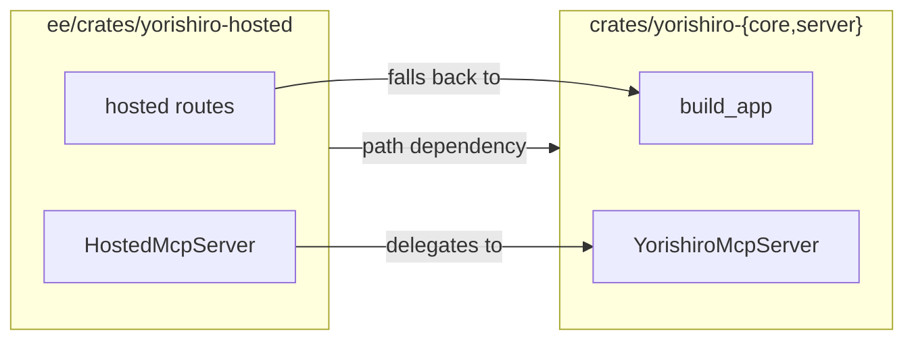

# Yorishiro Enterprise Edition (`ee/`)

**English** | [日本語](docs/ja/README.md)

The paid half of Yorishiro. Everything in this directory is licensed under [`ee/LICENSE`](LICENSE), not the BUSL-1.1 that covers the rest of the repository.

For the product as a whole, see [the root README](../README.md).

## What is in here, and why

A feature belongs in `ee/` by its character, not by what it depends on. The test is: **does the server itself call an LLM, take a payment, talk to an external SaaS, or serve a rich UI?**

| Under `ee/` | Because |
|---|---|
| Marketplace (`/api/marketplace/*`) | Distribution between tenants |
| Origin and merge chain (`/api/schemas/upstream-changes`, `merge-preview`, `merge`) | Flowing a template's later edits into the copies made from it |
| Billing (`/hosted/stripe/webhook`) | Stripe |
| OAuth2/OIDC login (`/auth/oauth/*`) | An external identity provider |
| Tenant dashboard (`/hosted/tenant/overview`) | |
| Fill mode B | The server makes an outbound chat completion. A bring-your-own-key design moves who pays for it without changing that |
| The SPA (`web/`) | A rich UI |

"The user brings their own key" does not move a feature out of `ee/`, and neither does "it does not depend on X". Ask what the feature *is*.

## How it composes with the free half

`crates/yorishiro-{core,server}` must not depend on `ee/`. The dependency runs one way, and one binary composes both.

The seams `ee/` composes against are `build_app`, `apply_observability_layers`, `into_http_parts()`, `hex_decode` and `bearer_credential`. Those five stay whatever a dead-code grep says, because nothing calls them from inside the free half. `http::mcp::YorishiroMcpServer` is a sixth, and it is deliberately not on that list: `ee/` calls it, so a workspace-wide grep finds the caller.

`ee/`'s router is matched first and falls back to the community router, so it can add a path or take one over. Overriding a path overrides **every method on it**: define every method a path needs, or leave the path alone.

## Running it

There is one binary, `yorishiro-server`, and it contains both halves. The paid features are gated at runtime by a licence key in `YORISHIRO_LICENSE_KEY`, not at compile time.

Without a key the server starts normally and the paid surfaces answer `404`. A key that is present but invalid or expired is the same as no key, logged at `warn` rather than refusing to boot: a paid-feature misconfiguration should not take the free half down with it.

`yorishiro-ce-server` is the other binary, BUSL-1.1 only, with no trace of this directory in it. A release gate greps the artifact to prove that, and asserts the same markers **are** present in the paid binary, or the check would pass by matching nothing.

## Documentation

- [API](docs/api.md) ([日本語](docs/ja/api.md)) for the endpoints this edition adds
- [Configuration](docs/configuration.md) ([日本語](docs/ja/configuration.md)) for the variables it reads
- [Deployment](docs/deployment.md) ([日本語](docs/ja/deployment.md))
- [Web UI](docs/web-ui.md) ([日本語](docs/ja/web-ui.md)) for the SPA under `web/`

## Licence

[`ee/LICENSE`](LICENSE). This is the only directory it covers; everything outside it is [BUSL-1.1](../LICENSE).
