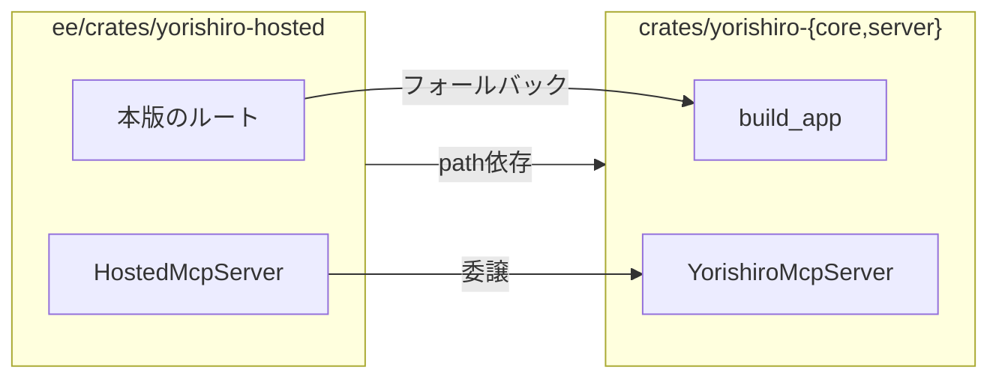

# Yorishiro エンタープライズ版(`ee/`)

[English](../../README.md) | **日本語**

Yorishiro の有償側です。
このディレクトリ配下はすべて [`ee/LICENSE`](../../LICENSE) が適用され、リポジトリの他の部分を覆う BUSL-1.1 とは別のライセンスです。

製品全体については[ルートのREADME](../../../docs/ja/README.md)を参照してください。

## 何がここにあり、なぜか

機能が `ee/` に属するかは、依存先ではなく性格で決まります。
判定はこうです。**サーバ自身がLLMを呼ぶか、決済を扱うか、外部SaaSと話すか、リッチUIを提供するか。**

| `ee/` にあるもの | 理由 |
|---|---|
| マーケットプレイス(`/api/marketplace/*`) | テナント間の配布 |
| 出自とマージ連鎖(`/api/schemas/upstream-changes`、`merge-preview`、`merge`) | テンプレートの後の編集を、そこから複製されたスキーマへ流す |
| 課金(`/hosted/stripe/webhook`) | Stripe |
| OAuth2/OIDCログイン(`/auth/oauth/*`) | 外部のIDプロバイダ |
| テナントダッシュボード(`/hosted/tenant/overview`) | |
| フィルのモードB | サーバが外向きのchat completionを呼ぶ。BYOキー方式は負担先を移すだけでこの性質を変えない |
| SPA(`web/`) | リッチUI |

「利用者が自分のキーを持ち込む」は `ee/` から外す理由になりません。
「Xに依存しない」も同様です。
その機能が*何であるか*を見てください。

## 無償側との合成

`crates/yorishiro-{core,server}` は `ee/` に依存しません。
依存は一方向で、1つのバイナリが両方を composeします。

`ee/` が composeする継ぎ目は `build_app`・`apply_observability_layers`・`into_http_parts()`・`hex_decode`・`bearer_credential` の5つです。
無償側からは誰も呼ばないため、この5つはデッドコード判定のgrepが何を言おうと維持します。
`http::mcp::YorishiroMcpServer` は6つ目ですが、意図的にこの一覧に入れていません。
`ee/` が呼び出す以上、ワークスペース全体のgrepが呼び出し元を見つけるためです。

`ee/` のルータが先に照合され、コミュニティ版のルータへフォールバックします。
パスの追加も乗っ取りもできますが、**パスを上書きするとそのパスの全メソッドを上書きします**。
必要なメソッドをすべて定義するか、そのパスには触れないかのどちらかです。

## 動かす

バイナリは `yorishiro-server` の1本で、両方の半分を含みます。
有償機能はコンパイル時ではなく、実行時に `YORISHIRO_LICENSE_KEY` のライセンスキーで開きます。

キーが無ければサーバは通常どおり起動し、有償のサーフェスが `404` を返します。
キーがあっても不正または期限切れなら、キーが無い場合と同じ扱いです。
起動を拒否せず `warn` で記録します。
有償機能の設定ミスで無償側まで落とすべきではないためです。

もう1本のバイナリ `yorishiro-ce-server` は BUSL-1.1 のみで、このディレクトリの痕跡を含みません。
リリースgateが成果物をgrepしてそれを証明し、同じマーカーが有償バイナリには**存在すること**もあわせて検査します。
そうしないと、何にも一致しないことで検査が通ってしまうためです。

## ドキュメント

- [API](api.md)：本版が追加するエンドポイント
- [設定](configuration.md)：本版が読む変数
- [デプロイ](deployment.md)
- [Web UI](web-ui.md)：`web/` のSPA

## ライセンス

[`ee/LICENSE`](../../LICENSE)。
このディレクトリだけが対象で、外側はすべて [BUSL-1.1](../../../LICENSE) です。
